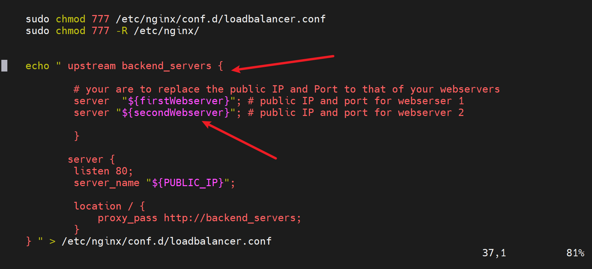

# Automating Loadbalancer configuration with Shell scripting

## Automating the Deployment of Webservers

In this module we will be automating the entire process of loadbalancing using shell scripting

1. We need not provision two Ec2 instances

2. Edit Inbound rules to open up port 8000

3. Next is to connect to our instances using ssh

4. Create a shell script
`vi install.sh`
and then write the script with a placeholder for our PublicIP

5. Make the script executable `chmod u+x install.sh`

6. Run the script thus `./install.sh PUBLICIP`

7. confirm if Apache2 is running on our webservers

## Deploying and configuring Nginx as a LoadBalancer using Shell scripting
To start with we will ssh into the instance of our loadbalancer.

We write a script that 
1. update our machine and install nginx 
2. creates the *loadbalancer config file* 
3. receives the *publicIP of the two webservers and the nginx as an argument* and uses the IP of two webservers as backend servers
4. this scripts also tells our server to listen to port80
5. checks if the config is ok 
6. restarts nginx 
7. we need to make this file executable `sudo chmod +x nginx.sh`
8. we then need to parse the *PUBLICIPS AS ARGUMENTS* thus `./nginx.sh PUBLIC_IP Webserver-1 Webserver-2`
where the variables are
- publicIP of the loadbalancer
- and the webservers respectively
 

we can check if our config file is present

### *Paste the publicIP of the loadbalancer*

## **Conclusion**

A shell script is a text file that contains a sequence of commands for a UNIX-based operating system. It is called a shell script because it combines a sequence of commands, that would otherwise have to be typed into the keyboard one at a time, into a single script.This is very useful in deploying servers really fast