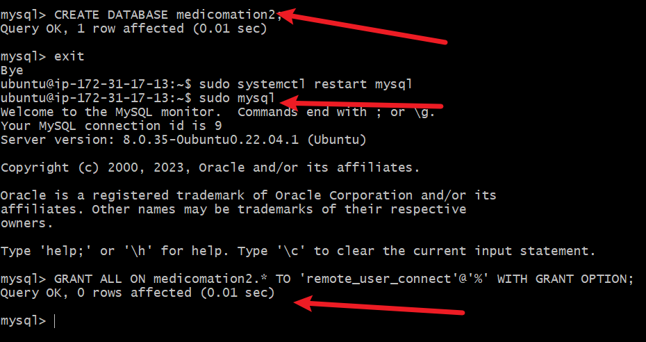

# **How to implement a Client Server Architecture using MySQL Database Management System(DBMS)**

A client-server architecture for DBMS is one in which data is stored on a central server, but clients connect to that server in order to access and manipulate the data. This type of architecture is more complex than a centralized architecture, but it offers several advantages over the latter.

## Advantages
1. One of the main benefits of a client-server architecture is that it is more scalable than a centralized architecture. 

2. Another advantage of a client-server architecture is that it is more fault-tolerant than a centralized architecture. If a single server goes down, other servers can take over its responsibilities, and clients can still access the data.

## Implementation...

---
To demonstrate a basic client-server using *MYSQL RDBMS*
we start by creating two instances
- First Server named *mysql-server*
- Second Server named *mysql-client*

Next, is to allow the client to have an access to the server instance thus

### ssh to a Version control system
In this case, i have used **Gitbash**

We install `mysql-sever` after an `update` on the instance named *mysql-server* earlier

Edit the mysql-server configuration file `sudo vi /etc/mysql/mysql.conf.d/mysqld.cnf`
*This will allow us connect from a localhost*

## Connect Remotely to the mysql-DBserver from the mysql-client

This is achieved by 
- Running a `mysql secure installation` to createa database password.
- we then create a user with a username

- Create a DB
Here our first DB is named *medicomation*
 

- We need to grant priviledges to this new user named *remote_user_connect* in this case

*Restart mysql-server*
`sudo systemctl restart mysql-server`

- Connect from the local host

These steps were repeated to create a second database 

## Conclusion
Both centralized and client-server architectures for DBMS have their own advantages and disadvantages, and the choice of architecture will depend on the specific needs of the application. Centralized architectures are simpler and easier to manage, but they can become a bottleneck as the system grows in size. Client-server architectures are more complex, but they are more scalable and fault-tolerant, making them a better choice for larger and more critical systems.

