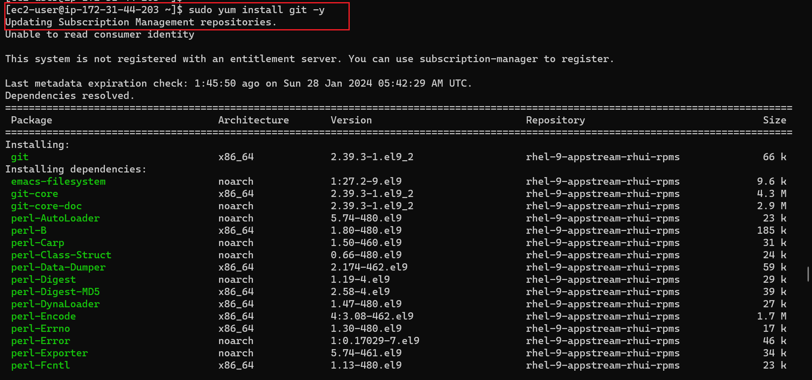
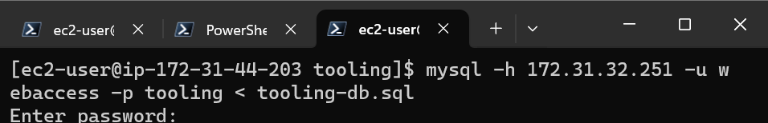
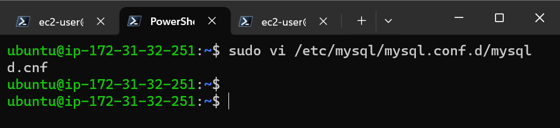

#  Devops Tooling Website Solution
## NFS Server Preparation
AWS provides three popular services — S3, Elastic Block Store (EBS), and Elastic File System (EFS) — which work quite differently and offer different levels of performance, cost, availability, and scalability. 

**Amazon S3**provides simple object storage, useful for hosting website images and videos, data analytics, and both mobile and web applications. Object storage manages data as objects, meaning all data types are stored in their native formatsThere is no hierarchy of relations between files with object storage — data objects can be distributed across several machines. You can access the S3 service from anywhere on the internet.

**AWS EBS** provides persistent block-level data storage. Block storage stores files in multiple volumes called blocks, which act as separate hard drives; block storage devices are more flexible and offer higher performance than regular file storage. You need to mount EBS onto an Amazon EC2 instance. Use cases include business continuity, software testing, and database management. Learn more about EBS volume types and common operations.

**AWS EFS** is a shared, elastic file storage system that grows and shrinks as you add and remove files. It offers a traditional file storage paradigm, with data organized into directories and subdirectories. EFS is useful for SaaS applications and content management systems. You can mount EFS onto several EC2 instances at the same time. 

### Implementation
We are going to be launching 4 (**3 Webservers and one for our NFS**) instances for this project on AWS with RHEL Linux 8 Operating System 

We will be having another instance for our DB which will run on an UBUNTU OS

We should end up with 

Next is to have 3 volume attached to our NFS just like the previous project
### Connect to instance using ssh

### Inspect the blocks available

### create a partition for all three volumes to be used for logical volumes

To end upwith a disk like this 
### Install lvm2

### Create a physical volume and a volume group

### Create 3 logical volumes 
- lv-opt
- lv-apps
- lv-logs
### 

### Format the 3 disks as xfs
### Make a directory `/mnt/apps` and mount the lv-apps there This will be used by the webservers
### Make a directory `/mnt/logs` and mount the lv-logs there This will be used by the webservers logs

### Make a directory `/mnt/opt` and mount the lv-opt there This will be used by the jenkins server in the next project

## INSTALL NFS SERVER AND CONFIGURE IT THUS
`sudo yum -y update`
`sudo yum install nfs-utils -y`
`sudo systemctl start nfs-server.service`
`sudo systemctl enable nfs-server.service`
`sudo systemctl status nfs-server.service`

### Set up Permission that will allow our Webservers to -rwx files on NFS `sudo chown -R nobody: /mnt/apps``sudo chown -R nobody: /mnt/logs``sudo chown -R nobody: /mnt/opt``sudo chmod -R 777 /mnt/apps``sudo chmod -R 777 /mnt/logs``sudo chmod -R 777 /mnt/opt``sudo systemctl restart nfs-server.service`

### Configure access to NFS for clients within the same subnet by writing this `/mnt/apps <Subnet-CIDR of client webserver>(rw,sync,no_all_squash,no_root_squash)/mnt/logs <Subnet-CIDR of client webserver>(rw,sync,no_all_squash,no_root_squash)/mnt/opt <Subnet-CIDR of client webserver>(rw,sync,no_all_squash,no_root_squash)` into the exports file using `sudo vi /etc/exports` substitute the CIDR. Then use the command `sudo exportfs -arv` for export  of these files to our webserver
### Confirm the Ports being used by NFS`rpcinfo -p | grep nfs` and Open it Using the SG i.e Add new inbound rule**In order for NFS server to be accessible from your client, you must also open following ports: TCP 111, UDP 111, UDP 2049 ** 
# BACKEND DATABASE CONFIGURATION
### Connect to the database instance using ssh  Then update and install mysql  Create a database named `tooling` Create a Database User and name it `webaccess` and Grant permission to the user only from the webservers `subnet cidr`  Confirm if all is intact 

# Prepare the Webservers

### 1. Connect to the webserver instance using ssh  Install NFS client on this server using `sudo yum install nfs-utils nfs4-acl-tools -y`

### 2. Mount `/var/www` and target the NFS's servers export for apps using `sudo mkdir /var/www`sudo mount -t nfs -o rw,nosuid <NFS-Server-Private-IP-Address>:/mnt/apps /var/www

### 3. we can test this mount by creating a file on the webserver to see it on the NFS backend server 

### 4. Make sure that the changes done on the webserver will persist by running `sudo vi /etc/fstab`  on the webserver 

### 5. Install a WEbserver agent like Apache or NGINX and php to serve your webcontent, Apache will be used in this project. This will be installed from Remi Repository thus
### `sudo yum install httpd -y` `sudo dnf install https://dl.fedoraproject.org/pub/epel/epel-release-latest-8.noarch.rpm` `sudo dnf install dnf-utils http://rpms.remirepo.net/enterprise/remi-release-8.rpm`  `sudo dnf module reset php` `sudo dnf module enable php:remi-7.4` `sudo dnf install php php-opcache php-gd php-curl php-mysqlnd` `sudo systemctl start php-fpm``sudo systemctl enable php-fpm``setsebool -P httpd_execmem 1`

### check the test page of the webserver 

## Repeat steps 1 to 5 for another 2 Webservers

### 6. Verify that Apache files and directories areavailable on Webserver in `/var/www` and also on NFS server in `/mnt/apps` 

### 7. Locate the Log Folder for Apache on the Webserver and mount it to NFS Server's export for logs. Repeat step 4 to ensure that your log persist

## Tooling
### Install git on your webserver using `sudo yum install git -y` then Fork the tooling source code from `https://github.com/darey-io/tooling`   while in the tooling Directory, Copy the html content in the tooling repo into `/var/www/html` thus `sudo cp -R html/. /var/www/html`  **Open port 80 on the webservers **  Disable SELinux `sudo setenforce 0``sudo vi /etc/sysconfig/selinux` and set `SELINUX=disabled` then restart httpd  and make this change permanent 
### Update the Website's Configuration to connect to the database thus   
### Apply `tooling-db.sql` script to your database using this command `sudo mysql -h <database_privateIP> -u <db-username> -p <passwordDB> < tooling-db.sql` from the tooling directory 
1. ###  this will require us to change the bind-address on our DB-Webserver instance`sudo vi /etc/mysql/mysql.conf.d/mysqld.cnf`
2. ### mysql also has to be installed before we use the script 

### The script creates new user which can be verified thus 
### Disable the welcome page on the webserver so it serves our content  and restart the httpd

### load webserver with publicip/index.php

