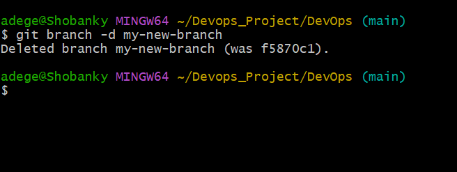

# Git init
### I created a directory then changed the directory to it. i thereafter initialized the directory to become a git repository. see image below 
* git init
# Git Commit
### i tracked a created index.txt file using git add then used the git commit.
* `git commit -m "message"` as shown below 
# Git Branch
###  Git branches are effectively a pointer to a snapshot of your changes. When you want to add a new feature or fix a bug—no matter how big or how small—you spawn a new branch to encapsulate your changes. i implemented as shown 
* `git branch`
# Git checkout
### I created a new branch and changed to it .This is identified with the asterisk sign after listing available branches using

# Git Merge
### I made some changes from another branch, after tracking and committing it, i then checked out to the main branch to merge the changes

# Git Branch Deletion
### i deleted a branch with git branch -d <branch> which i had created earlier. The -d option will delete the branch only if it has already been pushed and merged with the remote branch. Use -D instead if you want to force the branch to be deleted, even if it hasn't been pushed or merged yet. The branch is now deleted locally as shown below 

# GitHub
### This is a space that enables collaboration with other developers and also give access to view your projects. i created an account as shown below.

# Local Repository to Remote repository
### To allow for collaborations, i added a remote repository to the local repository as shown below 

### i thereafter pushed the changes made locally to my remote repository as shown below 

# Git clone
### this allows us to bring remote works locally as shown below 

