# Lamp Stack Impletentation

#### This is the use of multiple tools to websites and build applications.LAMP is an acronym for the operating system, Linux; the web server, Apache; the database server, MySQL; and the programming language, PHP. All four of these technologies are open source, which means they are community maintained and freely available for anyone to use. Developers use LAMP stacks to create, host, and maintain web content. It is a popular solution that powers many of the websites you commonly use today.

# Installing Apache2 and Creating a firewall
### Start by updating your Os
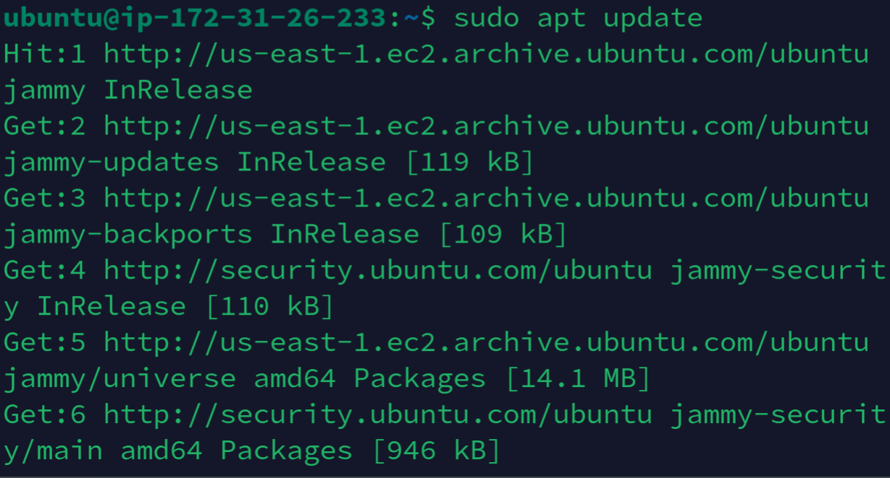
### This is the most widely used Webserver
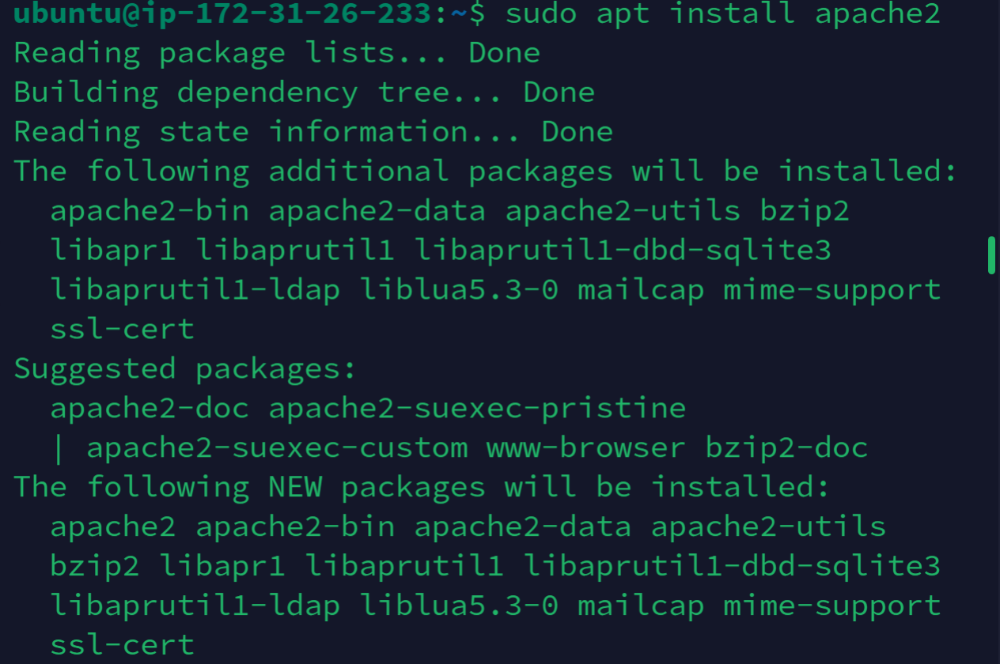

# Verify if Apache is Working 
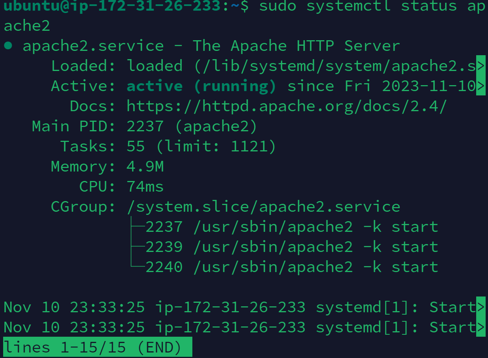

# Open Port 80 and launch your first website
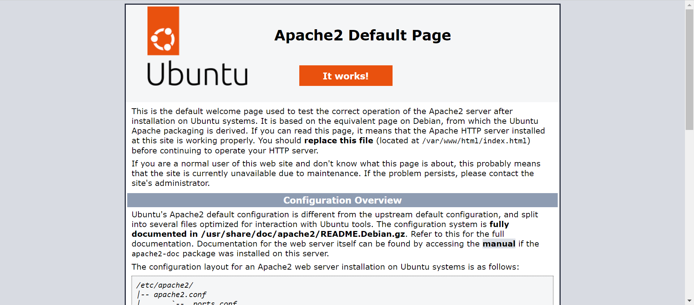

# DBMS
### we need to create our own database management system that can help manage data and present such data to Apache with no ambiguities
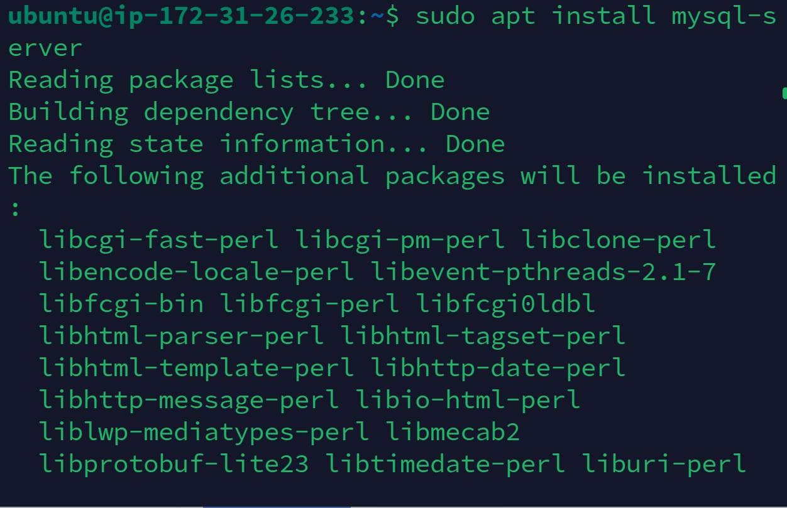
# Launch Mysql and validate
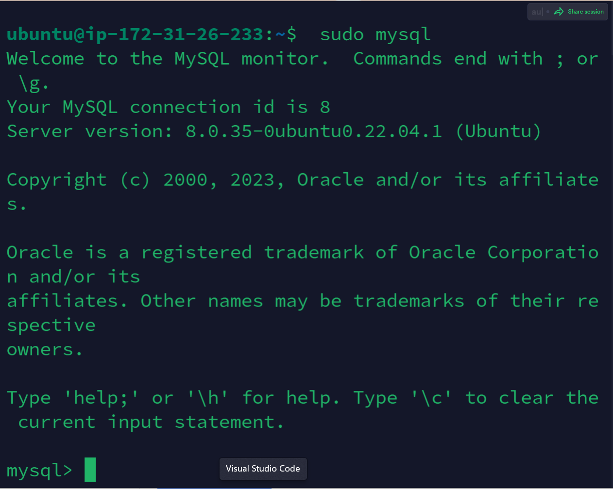
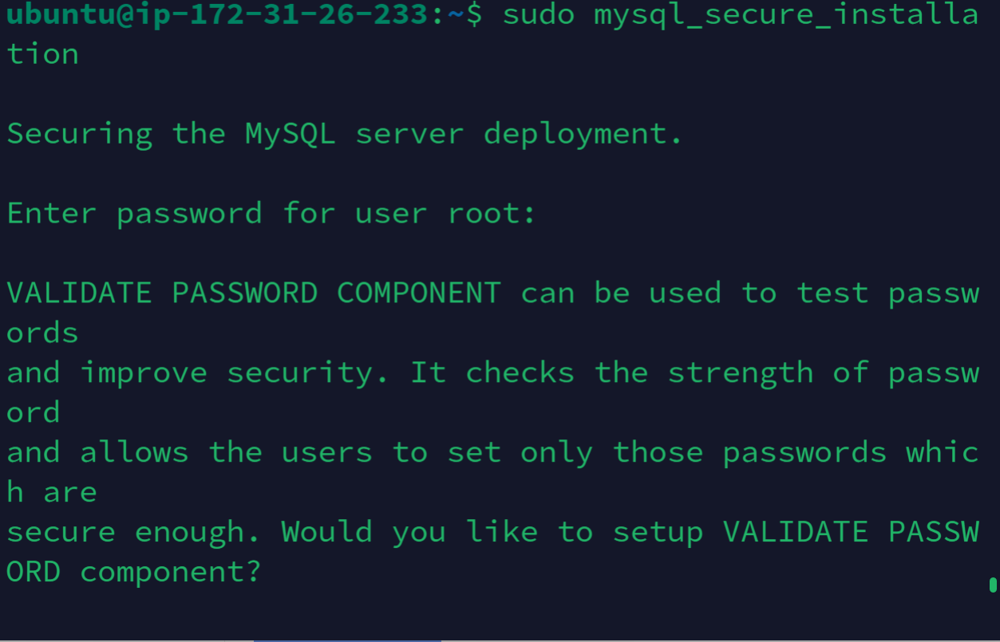

# Exit Mysql
next is to exit mysql
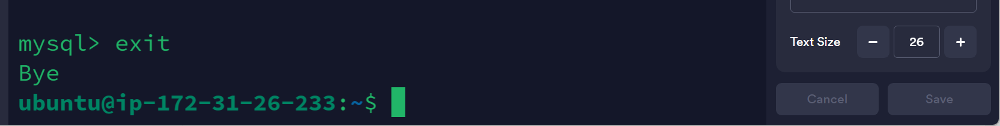

# Installing PHP
You have Apache installed to serve your content and MySQL installed to store and manage your data. PHP is the component of our setup that will process code to display dynamic content to the final user.
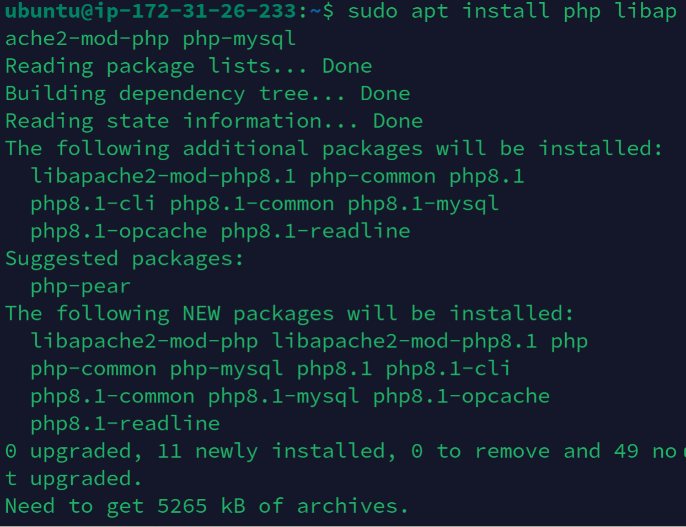
# Checking the version
Once the installation is finished, run the following command to confirm your PHP version:
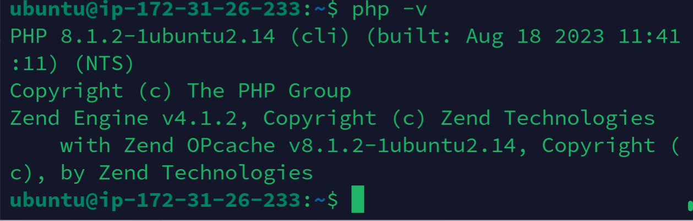
 # Own Webpage
 You can create your own webpage to be displaced by editing the index.html file.
 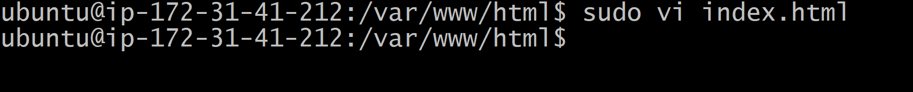
 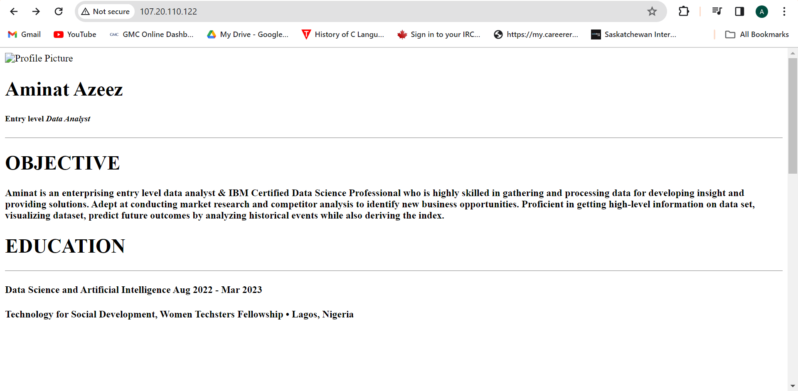

 # Creating a Virtual Host using Apache
 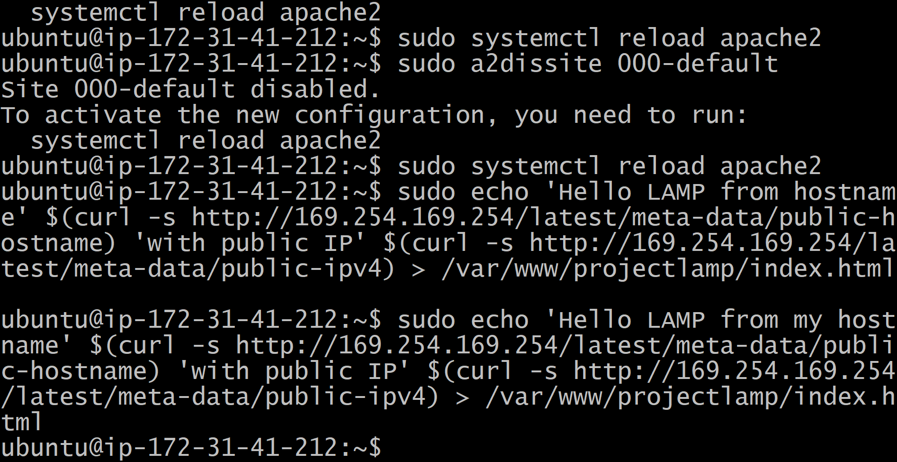
 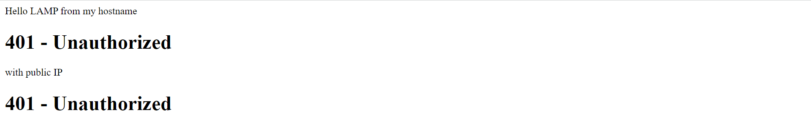