# cat Command

## Purpose
This stands for catalogue. it displays the content of a file and takes the desired filename to be displayed as argument. 

## Syntax
`cat [filename]`
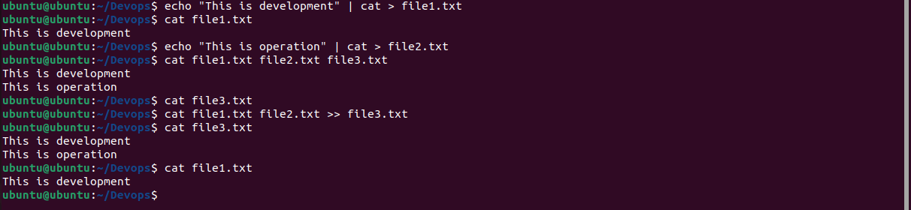

it returns the value 0 if it is successfully executed

# cd Command

## Purpose
This stands for Change directory and changes the directory to the specified file operand. when no file operand is specified, this automatically returns us back to the root folder

## Syntax
`cd [desired directory path]`
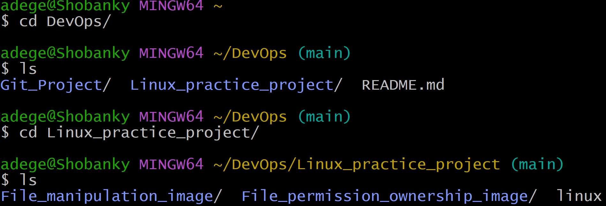

it returns the value 0 if it is successfully executed

#  cp Command

## Purpose
This stands for copy. It copies the content of a file to an existing or creates the file if not found
## Syntax
`cp [file to be copied] [file destination path]`
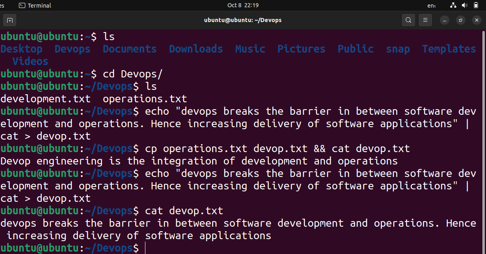

it returns the value 0 if it is successfully executed

# df Command

## Purpose
The df command displays information about total space usage and available space on a file system. The FileSystem parameter specifies the name of the device on which the file system resides, the directory on which the file system is mounted, or the relative path name of a file system

## Syntax
- df
- df -h
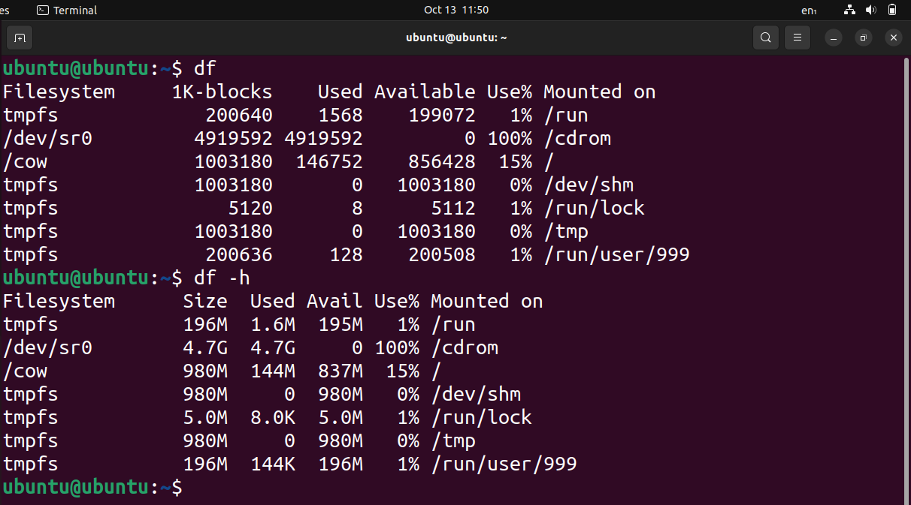

it returns the value 0 if it is successfully executed

# diff Command

## Purpose
It is called difference. It is used to compare two files side by side to tell the disparity. Used very well in debugging code files.

## Syntax
`diff [file1][file2]`
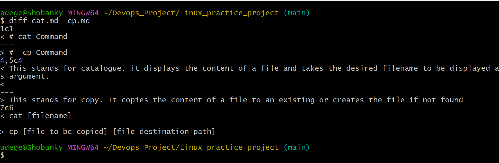

it returns the value 0 if it is successfully executed

# du Command

## Purpose
- du (abbreviated from disk usage) is a standard Unix program used to estimate file space usage—space used under a particular directory or files on a file system.
- du shows the blocks actually allocated to an individual file. df shows the blocks allocated in the entire file system, including inodes and other meta data.

## Syntax
`du [filepath]`
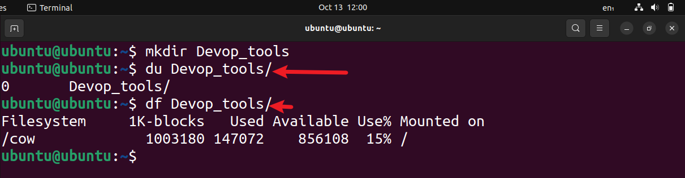

it returns the value 0 if it is successfully executed

# find Command

## Purpose
This searches through a specified directory for a particular file and perform further operations on the file, provided that the user has got a write permission.

## Syntax
the syntax is `find [directory path] -name [filename]`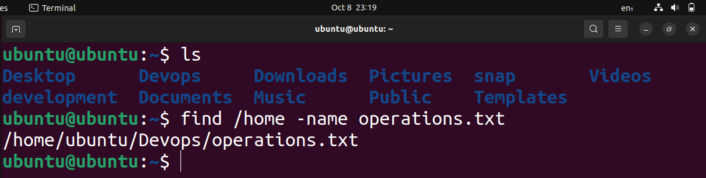

it returns the value 0 if it is successfully executed

# grep Command

## Purpose
while "find" gets you a desired file in a directory, grep searches through a file to find a desired word. It is also referred to as Global Regular Expression Print

## Syntax
`grep "expression" [filename]` the image is 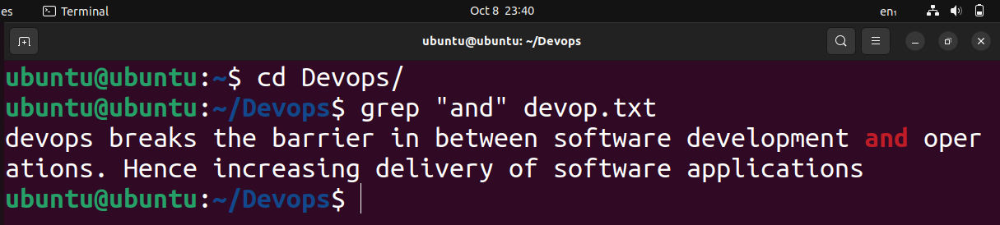

it returns the value 0 if it is successfully executed

# head Command

## Purpose
+ The head command, as the name implies, print the top N number of data of the given input. By default, it prints the first 10 lines of the specified files. If more than one file name is provided then data from each file is preceded by its file name. 

+ It can also be piped to list the N most recently used file in a directory after listing it out.

## Syntax
+ head [filename]
+ head -N [filename]
+ ls [option] | head -n N
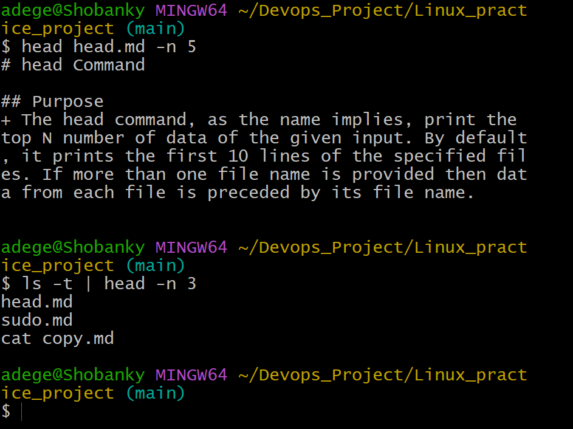

it returns the value 0 if it is successfully executed

# locate Command

## Purpose
Like the "find" command, locate finds a file in a database irrespective of the case or expressions used to name the file.

## Syntax
`locate [filename]`
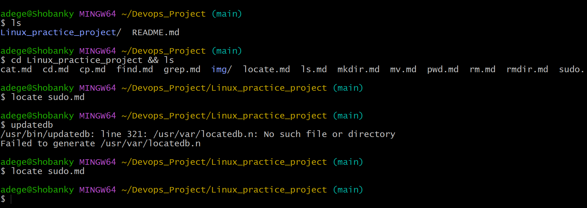

it returns the value 0 if it is successfully executed

# ls Command

## Purpose
This stands for list and displays all the files and directories which are present in the pwd.

## Syntax
`ls [flags]` 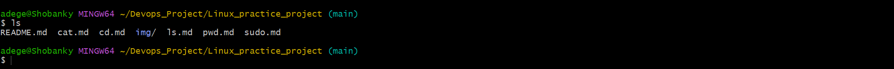

it returns the value 0 if it is successfully executed

# mkdir Command

## Purpose
This stands for make directory. It creates a new directory 

## Syntax
`mkdir [filename]` 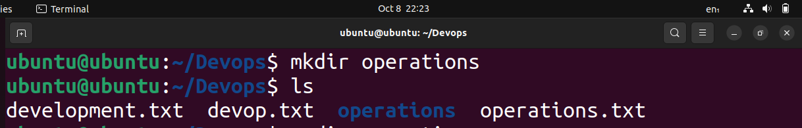

it returns the value 0 if it is successfully executed

# mv Command

## Purpose
This stands for move. it moves a file/directory from one path to a desired path. It is also used to rename a file.

## Syntax
+ `mv [filename] [/home/destination]`
+ `mv [old filename] [new filename] `
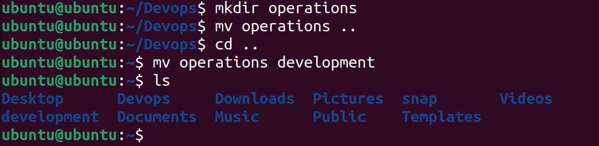

it returns the value 0 if it is successfully executed

# Pwd Command

## Purpose
This stands for Present working directory and displays the path which we are currently working on

## Syntax
`pwd [option]` 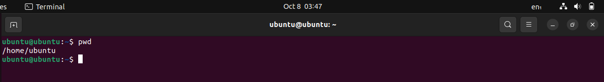

it returns the value 0 if it is successfully executed

# rm Command

## Purpose
This is used to  remove a file or multiple files completely from a directory 

## Syntax
- `rm [filename]`
- `rm [file1] [file2]`

it returns the value 0 if it is successfully executed

# rmdir Command

## Purpose
This stands for remove directory. It deletes a directory completely 

## Syntax
`rmdir [filename]` 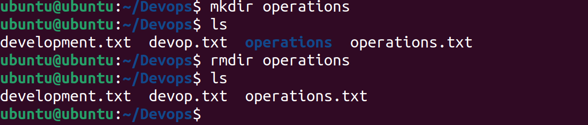

it returns the value 0 if it is successfully executed

# Sudo Command
 Sudo stands for "super user do" and it allows you to temporarily elevate your current user account to have root privileges.

## Syntax
 `sudo (command e.g apt install)` 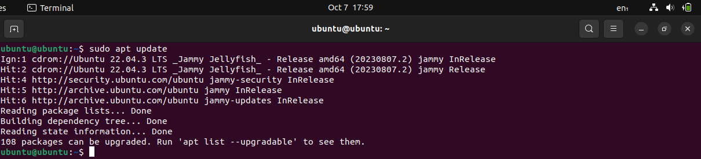

this will install a new package required to be ran on the terminal

# tail Command

## Purpose
It is the complementary of head command.The tail command, as the name implies, print the last N number of data of the given input. By default it prints the last 10 lines of the specified files. If more than one file name is provided then data from each file is precedes by its file name.

## Syntax
+ `tail [filename]`
+ `tail [filename] [filename]`
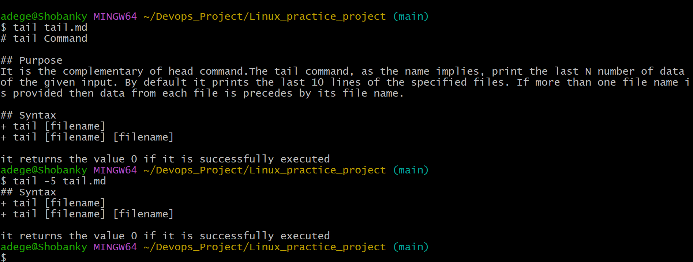

it returns the value 0 if it is successfully executed

# tar Command

## Purpose
This stands for tape archive. tar command in Linux is one of the important commands which provides archiving functionality in Linux. We can use the Linux tar command to create compressed or uncompressed Archive files and also maintain and modify them. 
## Syntax
tar [options] [archive file] [files to be archived] 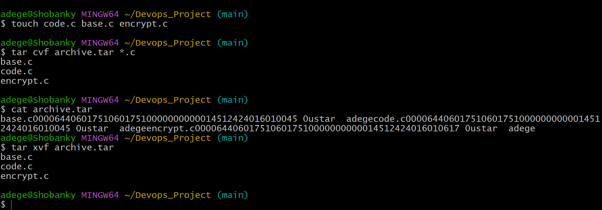

it returns the value 0 if it is successfully executed

#  touch Command

## Purpose
This stands for touch. it creates a new file or multiple files in the current working directory. 

## Syntax
+ `touch [filename]`
+ `touch [filename1] [filename1] [filename1]`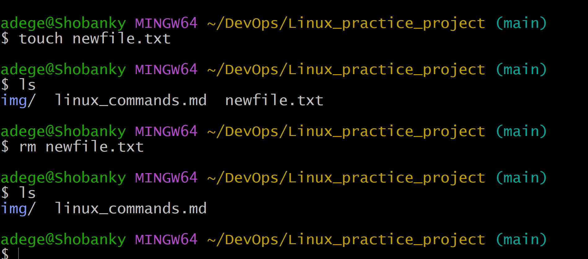
it returns the value 0 if it is successfully executed

# alias and unalias Command

## Purpose
When we often have to use a single big command multiple times, in those cases, we create something called as alias for that command. Alias is like a shortcut command which will have same functionality as if we are writing the whole command.

unalias deletes an existing alias
## syntax
alias CD='cat Devops'

unalias CD
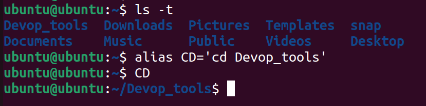

# apt-get Command
apt-get is a command-line tool that helps in handling packages in Linux. Its main task is to retrieve the information and packages from the authenticated sources for installation, upgrade, and removal of packages along with their dependencies
## Syntax
`apt-get [options] (command)`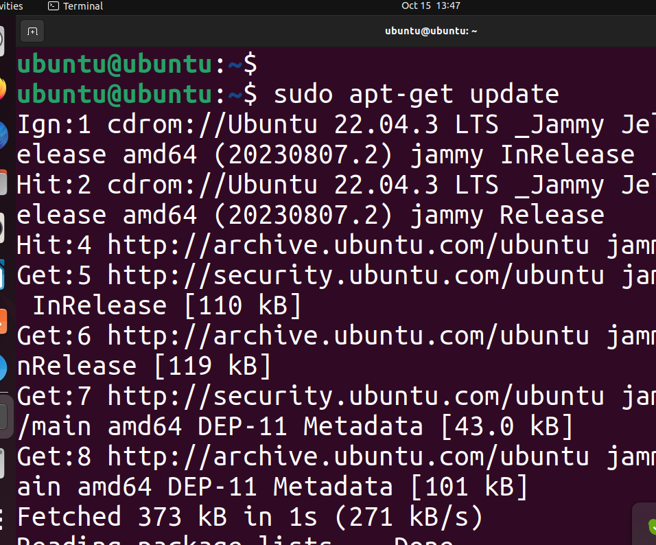 

# chmod Command

## Purpose 
The `chmod` command in Linux is used to modify the permissions and access mode of files and directories. These are the permissions that control who can read, write and execute the file.

## syntax
`chmod [option] [permission] [file_name]`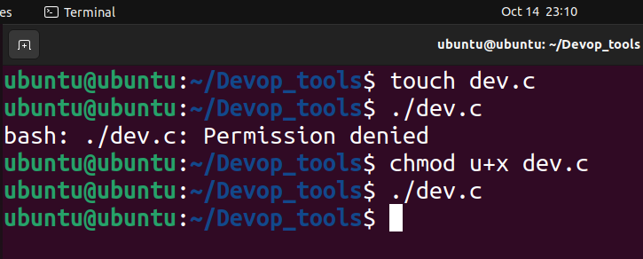

# chown Command
chown command is used to change the file Owner or group. Whenever you want to change ownership, you can use chown command. 

## Syntax
`chown [option] owner[:group] file(s)`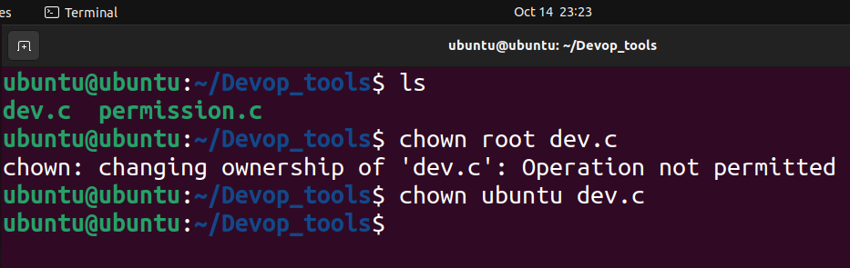

# echo Command
The echo command in Linux is a built-in command that allows users to display lines of text or strings that are passed as arguments. It is commonly used in shell scripts and batch files to output status text to the screen or a file.

## Syntax
`echo [option] [string]`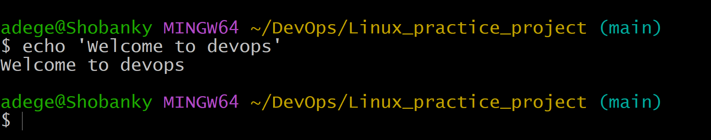

# history command
history command is used to view the previously executed command. This feature was not available in the Bourne shell. Bash and Korn support this feature in which every command executed is treated as the event and is associated with an event number using which they can be recalled and changed if required. These commands are saved in a history file. In Bash shell history command shows the whole list of the command.

## Syntax:
`$history`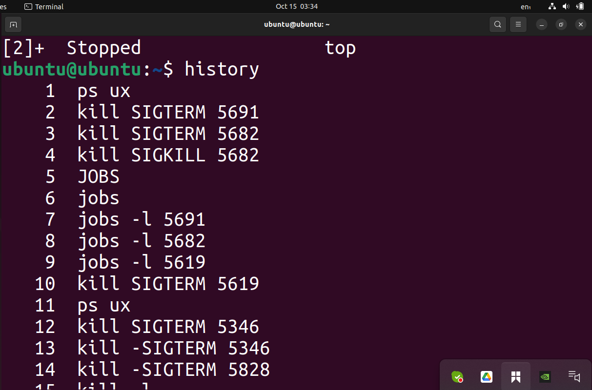

# hostname Command
this reaveals the system's hostname and with flags, it can also show the IP address
## Syntax
`hostname [options]`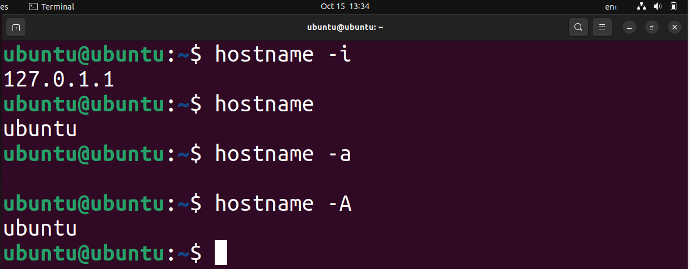

# htop command
htop command in Linux system is a command line utility that allows the user to interactively monitor the system’s vital resources or server’s processes in real time. htop is a newer program compared to top command, and it offers many improvements over top command. htop supports mouse operation, uses color in its output and gives visual indications about processor, memory and swap usage. htop also prints full command lines for processes and allows one to scroll both vertically and horizontally for processes and command lines respectively.

## syntax
`htop [options]`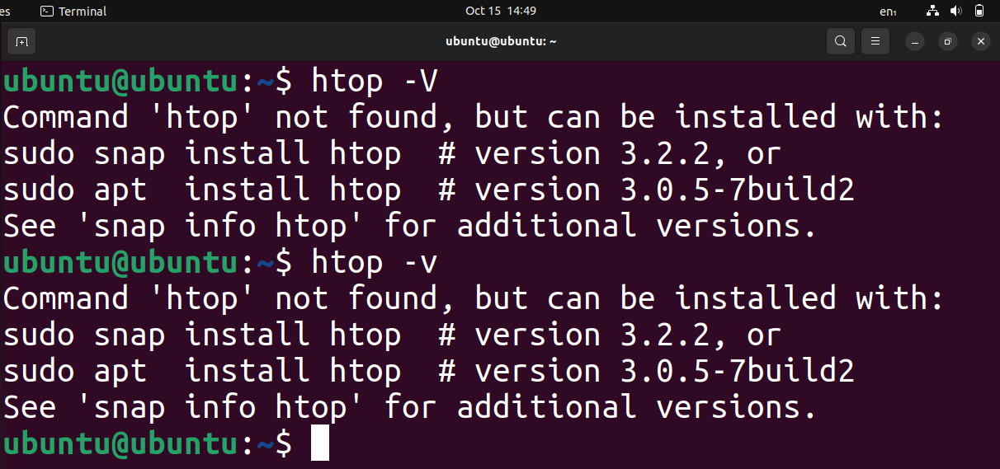

# jobs command
Jobs command is used to list the processes that you are running in the background and in the foreground. If the prompt is returned with no information no jobs are present. All shells are not capable of running this command. This command is only available in the csh, bash, tcsh, and ksh shells.

## syntax
`jobs [options] jobID`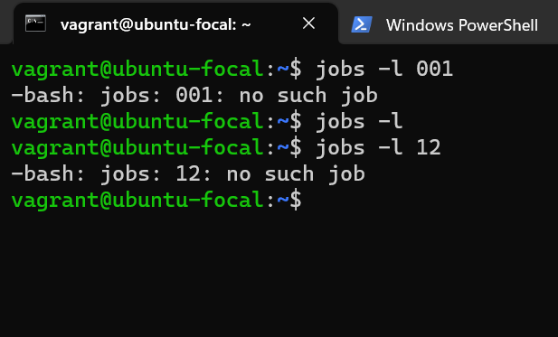

# kill Command
kill command in Linux (located in /bin/kill), is a built-in command which is used to terminate processes manually. kill command sends a signal to a process that terminates the process. If the user doesn’t specify any signal which is to be sent along with the kill command, then a default TERM signal is sent that terminates the process.

## Syntax
`kill [signal_option] pid`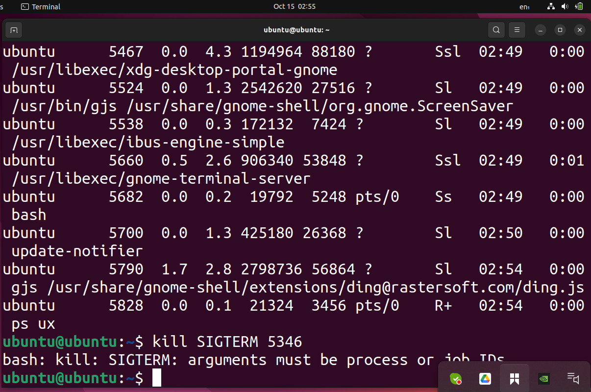

# man Command
reveals the usage of several linux commands including available options or flags

## Syntax
`man [command]`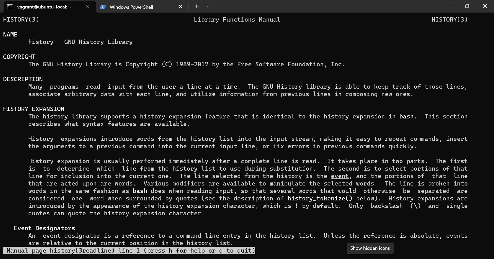

# nano_vi_jed command
This are text editors. Nano has a pseudo-graphical layout that makes it a little easier to jump right into. Both are viable options. Vi is a standard whereas Nano has to be available depending on the Linux OS you use

## Usage
+ nano [filename]
+ vi [filename]

# Ping Command
PING (Packet Internet Groper) command is used to check the network connectivity between host and server/host. This command takes as input the IP address or the URL and sends a data packet to the specified address with the message “PING” and get a response from the server/host this time is recorded which is called latency. Fast ping low latency means faster connection

## Syntax
`ping [option] [hostname_or_IP_address]`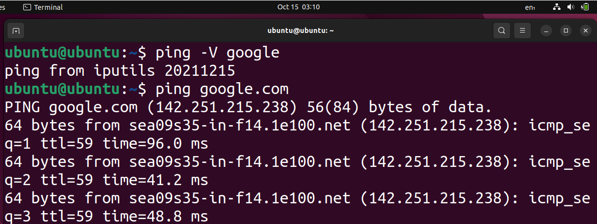

# ps Command
This reveals the processes and ids on a system. Also shows users.

# syntax
`ps [options]`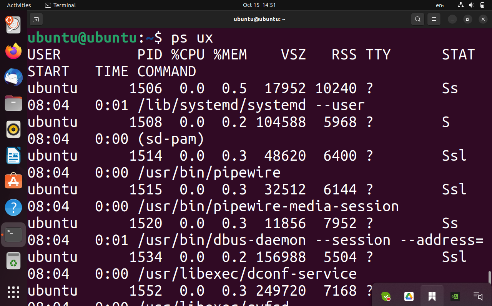

# su Command
su command in linux allows a user to switch to another user account and gain all of its privileges, while sudo command in linux allows a user to execute a specific command with the privileges of another user.

## usage
`su [options] [username [argument]]`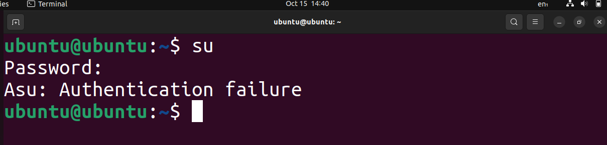

# top Command
it displays all the running processes and a dynamic real-time view of the current system. sums up resource Utilization.

## syntax
`top`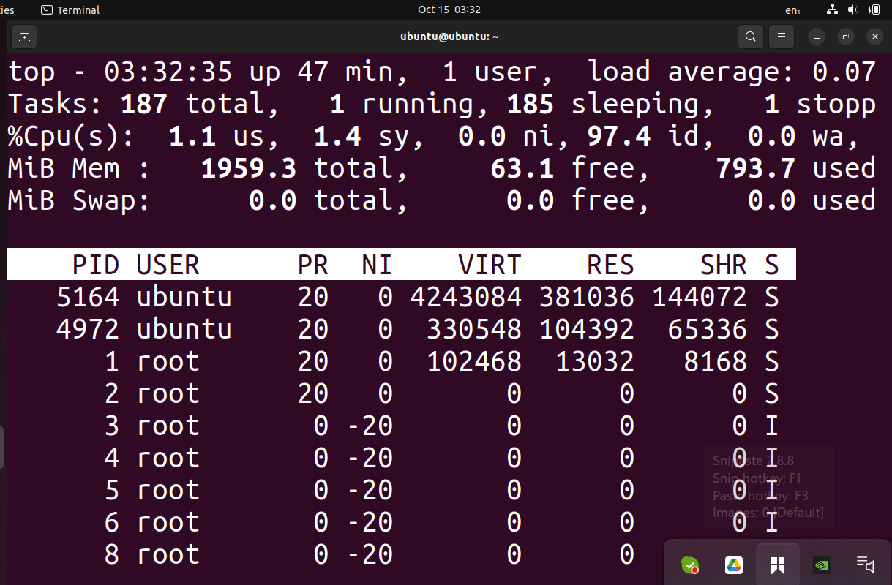

# uname Command
The command ‘uname‘ displays the information about the system.

## Syntax
`uname [options]`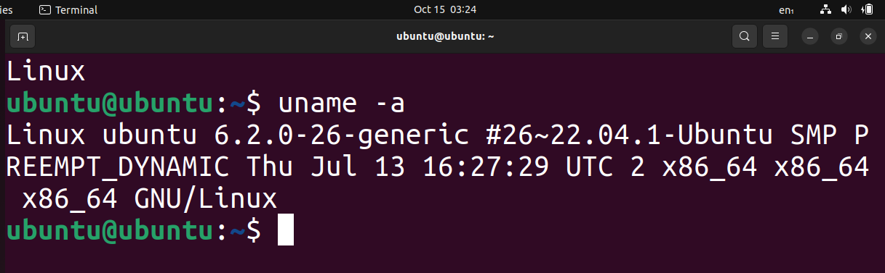

# unzip Command
this unzips deflated files by inflation

## Syntax
`unzip archive.zip`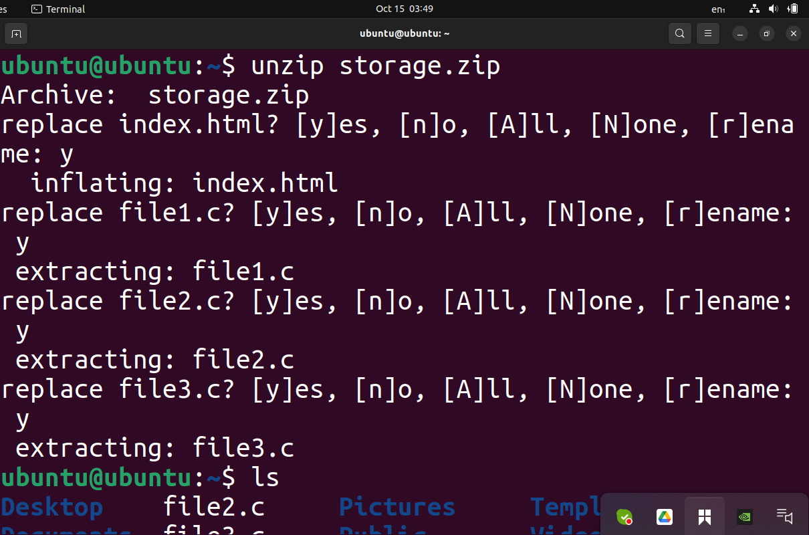

# useradd and userdel Command
this adds and deletes a user to linux respectively

## Syntax
+ `useradd [username]`
+ `passwd [newpassword]`
+ `userdel [username]`
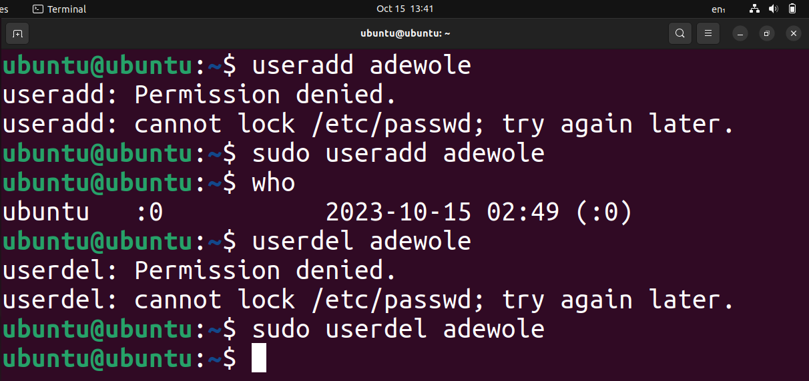

# wget Command
Wget is the non-interactive network downloader which is used to download files from the server even when the user has not logged on to the system and it can work in the background without hindering the current process. 

## Syntax
`wget [option] [url]`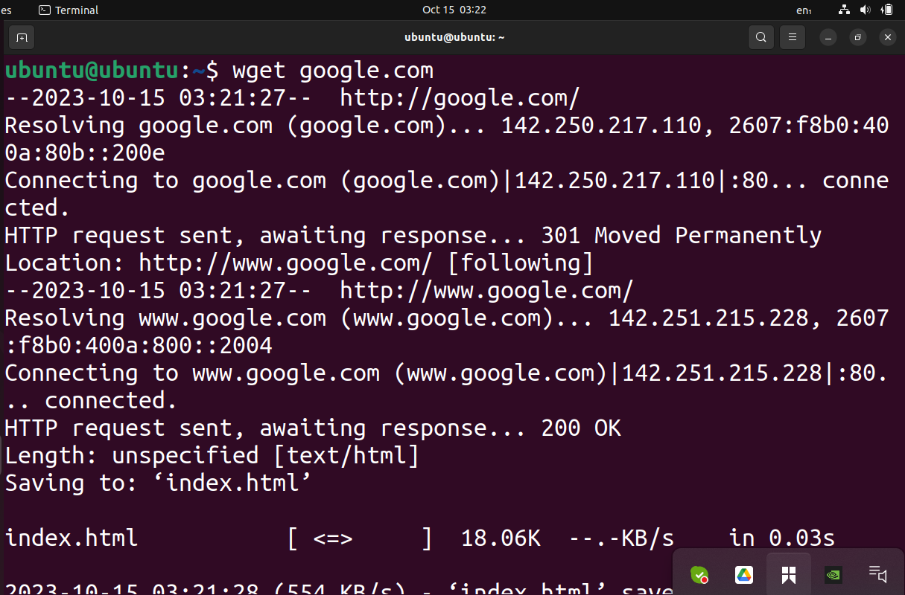

# zip Command 
Zip is used to compress files to reduce file size and is also used as a file package utility. Zip is available in many operating systems like Unix, Linux, windows, etc.

## Syntax
`zip [options] zipfile file1 file2…`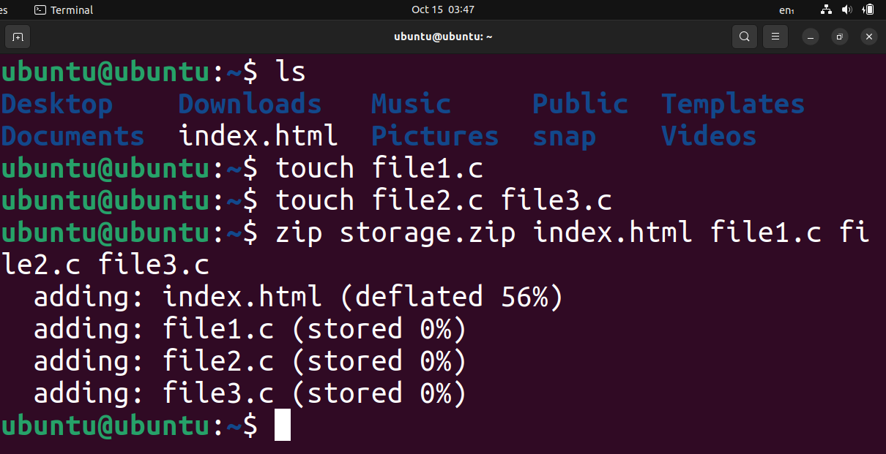.

