# **Nginx and LoadBalancing**

Load balancing is an excellent way to scale out an application and increase its performance and redundancy. Nginx, a popular web server software, can be configured as a simple yet powerful load balancer to improve your server’s resource availability and efficiency.
*Nginx acts as a single entry point to a distributed web application working on multiple separate servers.*
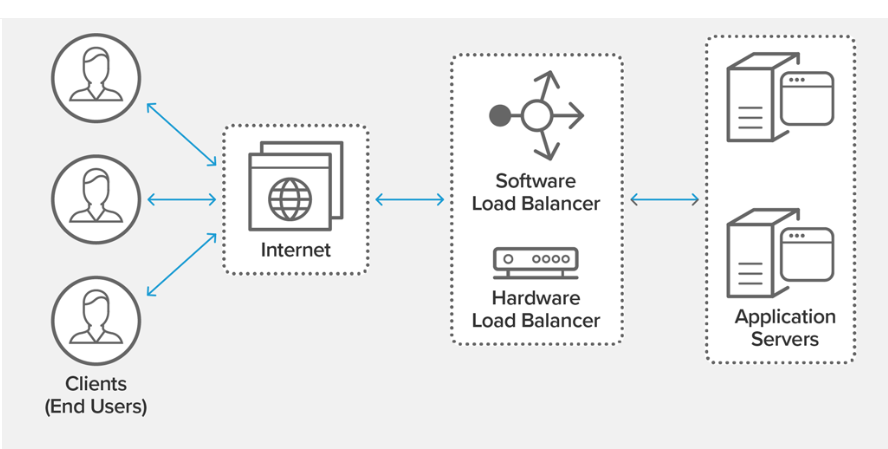
## *Installing Nginx*
The first thing to do is to set up *two servers* on a cloud like AWS.
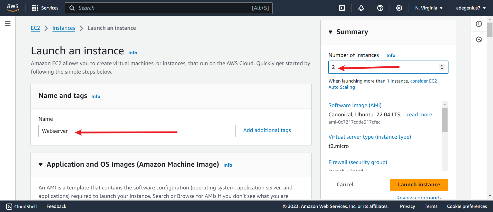
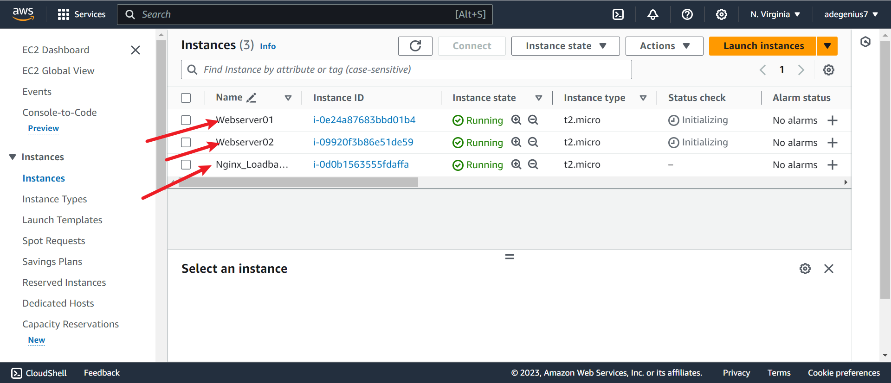 In this project, i have used an *Ubuntu Linux distribution*
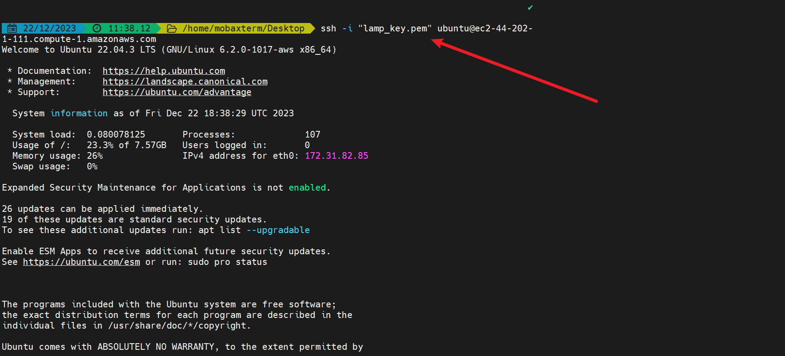
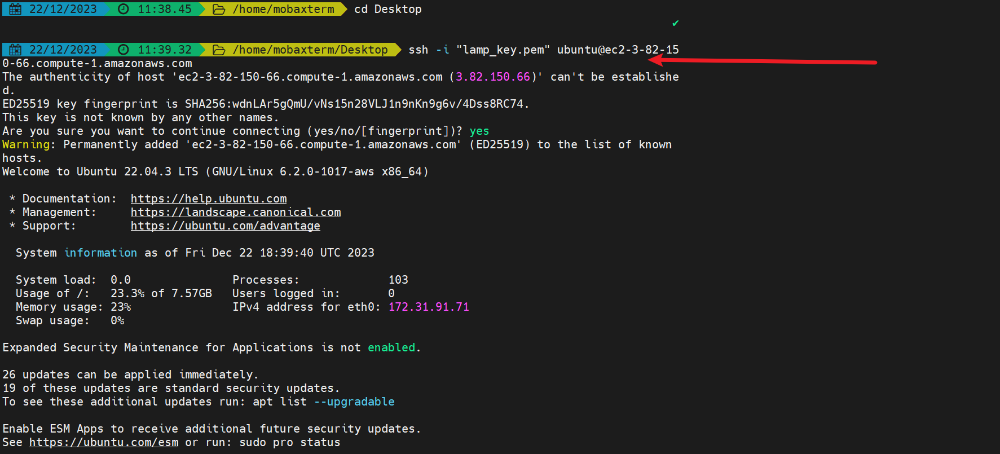

We then install apache2 web servers on the two instances
`sudo apt update -y`
`sudo apt install apache2 -y`
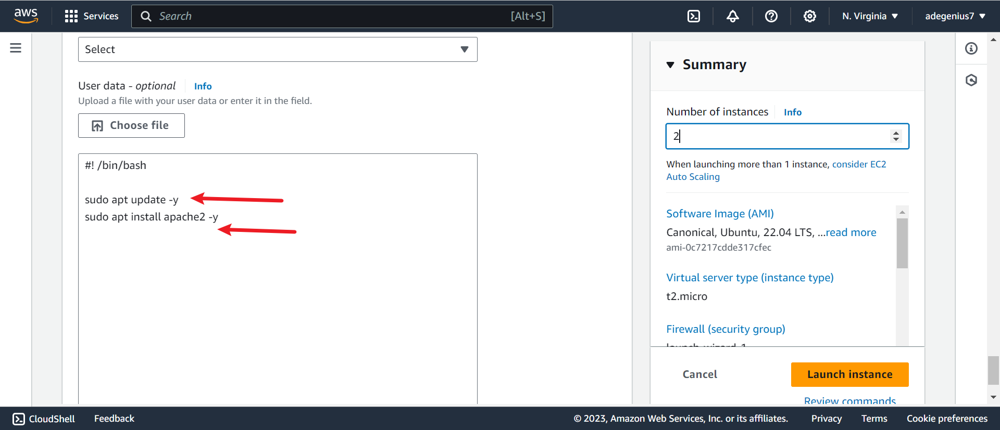
*This can either be done automatically or usage of the code blocks above*. I chose to automate it here in AWS

The next is to set up an instance for loadbalancing

`sudo apt update -y`
`sudo apt install nginx -y`

Then we check if our apps are running and active `sudo systemctl status nginx`
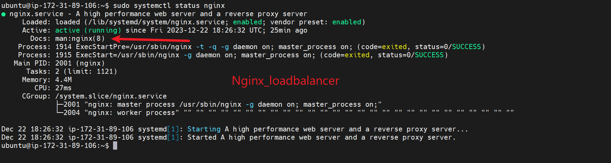
`sudo systemctl status apache2`
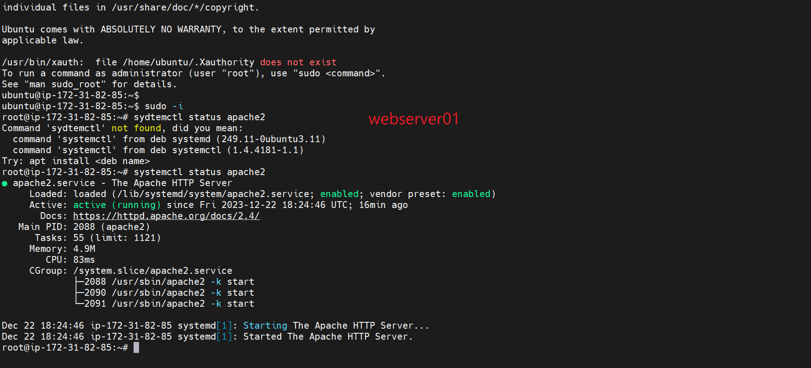
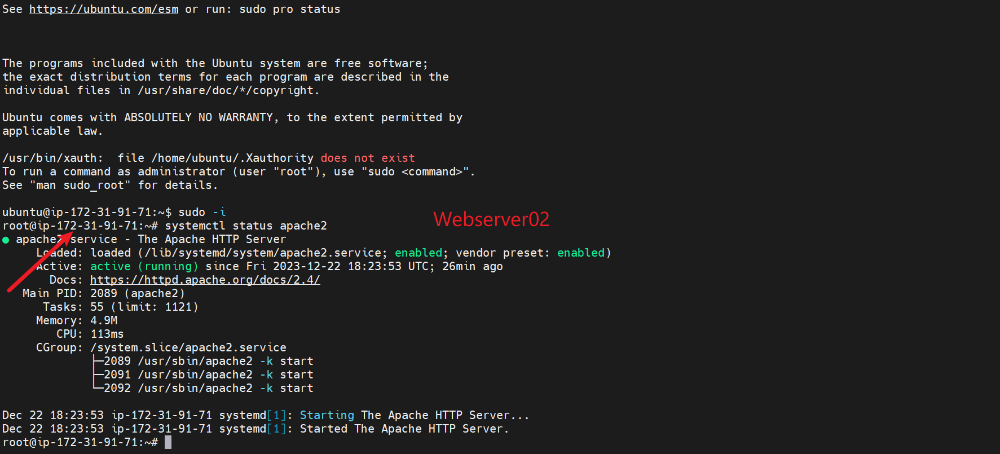

I then added a new listening directive for port 8000
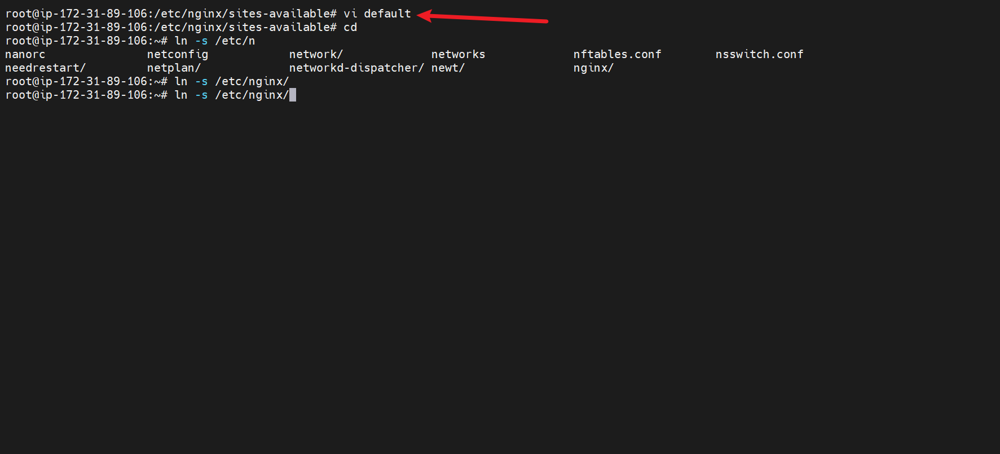
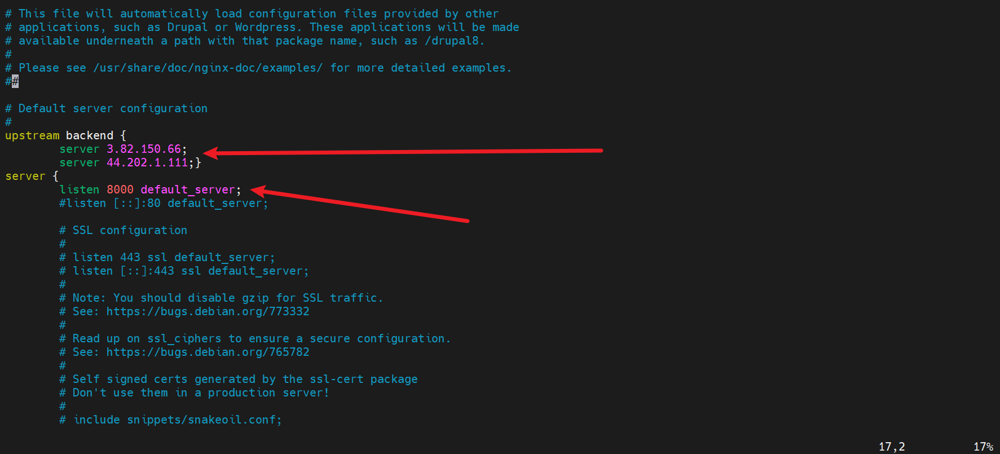
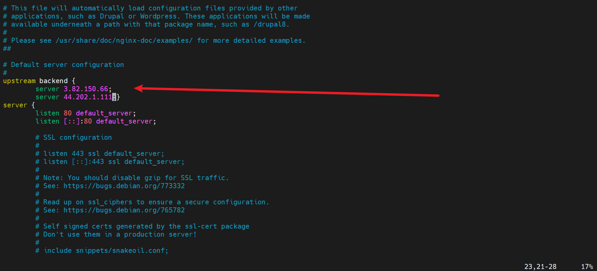

An *index.html* file should be created, where the server will serve it's content from
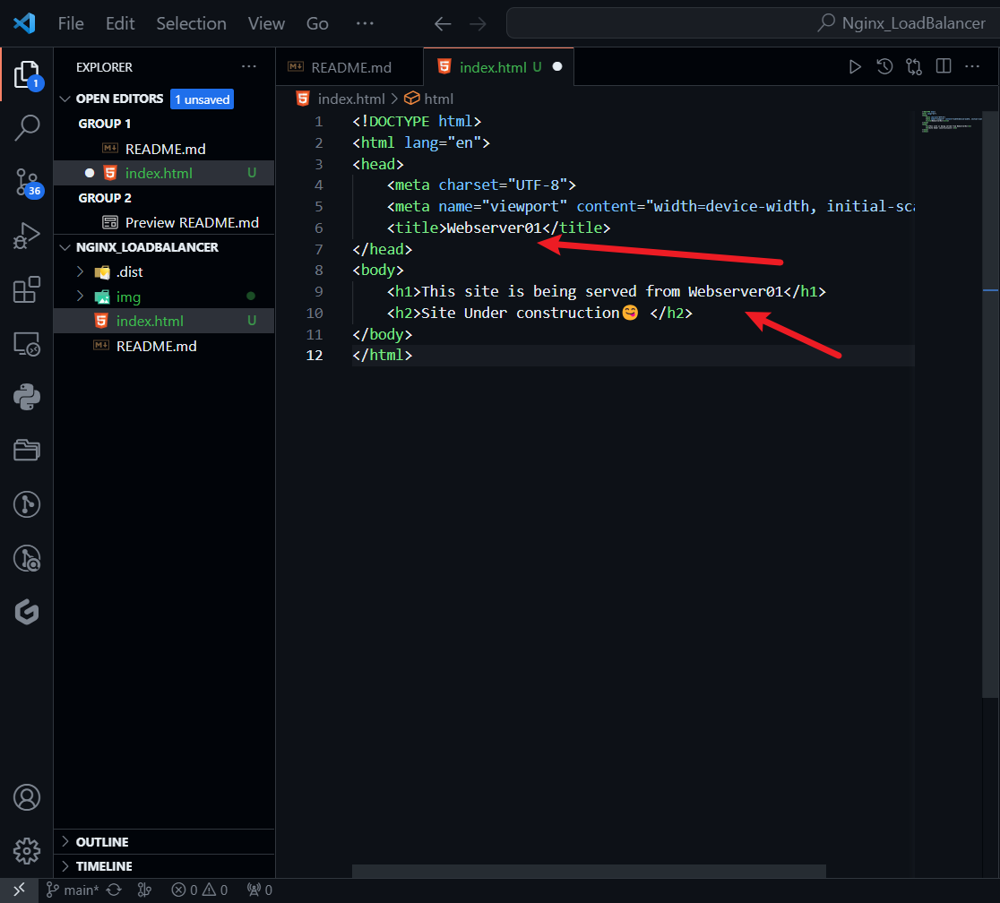

Change file Ownership of the index.html thus 
`sudo chown www-data:www-data ./index.html`

## Nginx as Loadbalancer

- On our Nginx server, we alter the configuration file thus
`sudo vi /etc/nginx/conf.d/loadbalancer.conf`

- secondly test the configuration
`ln`
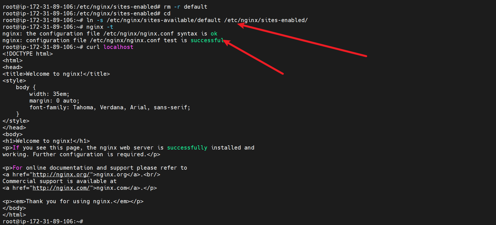

- we thereafter restart nginx
`sudo systemctl restart nginx`
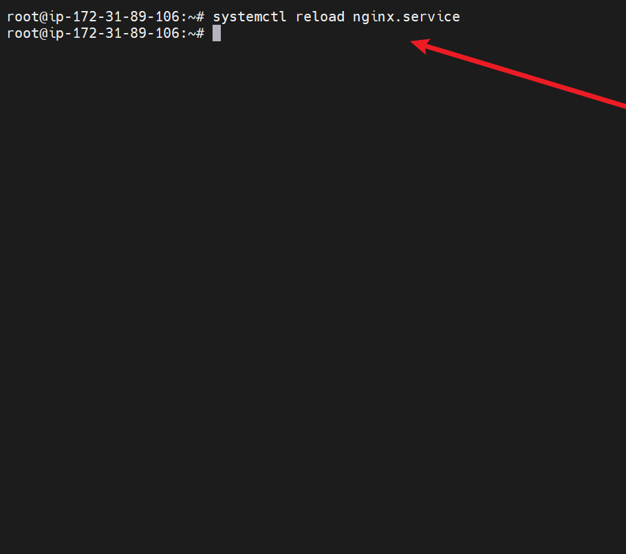
- check what is being served
`curl localhost`
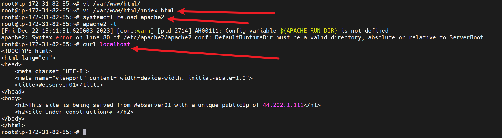
### **Paste the public ip of your nginx instance in your http browser**

### **Conclusion**
A load balancer acts as the “traffic cop” sitting in front of your servers and routing client requests across all servers capable of fulfilling those requests in a manner that maximizes speed and capacity utilization and ensures that no one server is overworked, which could degrade performance. If a single server goes down, the load balancer redirects traffic to the remaining online servers. When a new server is added to the server group, the load balancer automatically starts to send requests to it.

