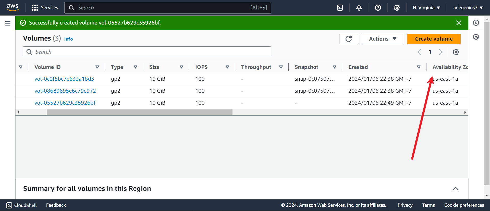
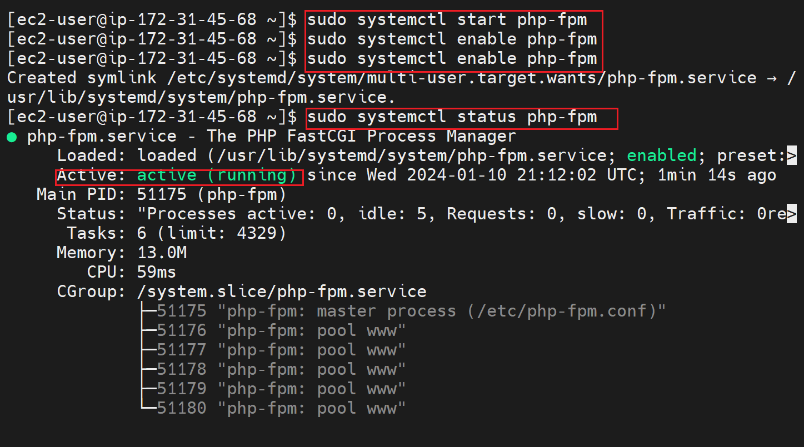
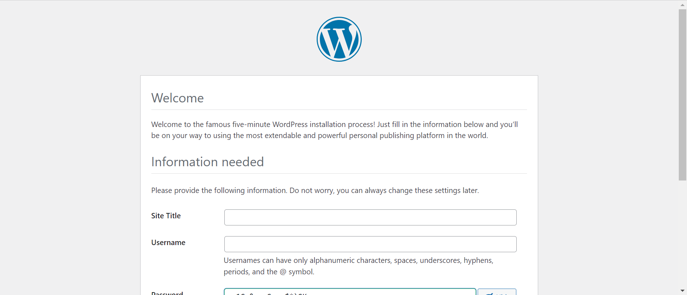

# Three-Tier Architecture
Managing disk space has always been a significant task for sysadmins. Running out of disk space used to be the start of a long and complex series of tasks to increase the space available to a disk partition. It also required taking the system off-line. This usually involved installing a new hard drive, booting to recovery or single-user mode, creating a partition and a filesystem on the new hard drive, using temporary mount points to move the data from the too-small filesystem to the new, larger one, changing the content of the /etc/fstab file to reflect the correct device name for the new partition, and rebooting to remount the new filesystem on the correct mount point.

LVM allows for very flexible disk space management. It provides features like the ability to add disk space to a logical volume and its filesystem while that filesystem is mounted and active and it allows for the collection of multiple physical hard drives and partitions into a single volume group which can then be divided into logical volumes.
### ** In this project** i will be implementing a mobile solution based on a **Three-tier Architecture**

### I will be spinning up an EC2 instance which will use a `RedHat OS` and serves as a **Webserver which Wordpress and our clientDB will reside** Launch the EC2 instance 
### **_____________________________________________________________**
###  Then ssh into the instance to open up Linux terminal to setup the configuration.

 ### will be spinning up another EC2 instances which will use a `RedHat OS` and serves as a **Database server which our mysql serverDB will reside** 
 

 ### Check Availabilty Zones of the instances
 - Availability Zones are multiple, isolated locations within each Region. Local Zones provide you the ability to place resources, such as compute and storage, in multiple locations closer to your end users.

### Create 3 volumes in the same Availability Zone on AWS
    

### Attach all three volumes one after the other to the **Webserver** EC2 instance  

### Inspect that your volumes are succesfully attached

This can also be verified from the Terminal using `lsblk` command

## CREATION OF PARTITIONS
A partition is a logical division of a hard disk that is treated as a separate unit by operating systems (OSes) and file systems.
Partitioning allows the use of different filesystems to be installed for different kinds of files. Separating user data from system data can prevent the system partition from becoming full and rendering the system unusable. Partitioning can also make backing up easier.
This is done with the use of the `gdisk` command
The gdisk command scans the specified hard disk for existing partitions and prints the result.
`sudo gdisk /dev/xvdf` we input `n` which is "NEW" for a new partition
Partition number ranges from 1 -128, hence we choose any number of our choice. In this project i have chosen
- 11 for xvdf -----> xvdf11
- 12 for xvdg -----> xvdg12
- 13 for xvdh -----> xvdh13

We can proceed to click `ENTER` if we desire to use the entire space for our partition, else we can specify the required space we desire A GUID will be requested for our desired partition.
**A GUID (globally unique identifier) is a 128-bit text string that represents an identification (ID). Organizations generate GUIDs when a unique reference number is needed to identify information on a computer or network. A GUID can be used to ID hardware, software, accounts, documents and other items. Linux LVM is 8e00** we should end up with this `p` can be used to inspect our partition before writing which will be done with `w`.
 `yes to exit`

## INSTALL LVM2
In Linux, Logical Volume Manager (LVM) is a device mapper framework that provides logical volume management for the Linux kernel.package using `sudo yum install lvm2`
LVM2, is the default for Red Hat Enterprise Linux, which uses the device mapper driver contained in the 2.6 kernel.
  

we can now inspect to see if the kernel has LVM to handle the logical volumes using `which lvm2` 

## PHYSICAL VOLUME CREATION
**You cannot create a physical volume directly on a device, it has to be in a partition. Hence we use our created Partitions `xvdf11 xvdg12 and xvdh13`.** The command to use for this is `pvcreate` thus
`sudo pvcreate /dev/xvdf11`
`sudo pvcreate /dev/xvdg12`
`sudo pvcreate /dev/xvdh13` More easily we can create these volumes at once as shown in the project image below

This can be confirmed using `sudo pvs`

## VOLUME GROUP CREATION
This is a concactenation of multiple physical volumes to becomne a **VolumeGroup** VG so that we can then use it logically.
It is the logical volumes that we can give to our servers. You do not give VGs to servers.(Remember we installed LVM for the kernel). For this we use the command `vgcreate` this way `sudo vgcreate webdata-vg /dev/xvdh13 /dev/xvdg12 /dev/xvdf11` and our VG `webdata-vg` can now be verified using `sudo vgs`

! 

## LOGICAL VOLUME CREATION
LVM2, can be used to gather existing storage devices into groups and allocate logical units from the combined space as needed.

The main advantages of LVM are increased abstraction, flexibility, and control. Logical volumes can have meaningful names like “databases” or "root-backup”. Volumes can also be resized dynamically as space requirements change, and migrated between physical devices within the pool on a running system or exported. LVM also offers advanced features like snapshotting, striping, and mirroring.

In this project we use `lvcreate` command to create two logical volumes. **apps-lv and logs-lv** Here the apps-lv will store data for the website, while the logs-lv will store data for logs.
`sudo lvcreate -n apps-lv -L 14G webdata-vg` 

`sudo lvcreate -n logs-lv -L 14G webdata-vg` 
We can confirm by running `sudo lvs`

we can use `sudo vgdisplay -v` to view our complete set up 

## FORMAT LVS USING EXT4
ext4 enables write barriers by default. It ensures that file system metadata is correctly written and ordered on disk, even when write caches lose power. This goes with a performance cost especially for applications that use fsync heavily or create and delete many small files
`sudo mkfs -t ext4 /dev/webdata-vg/apps-lv`

## MAKING WEBSITE DIRECTORIES
To serve our web content, we need to have a directory `sudo mkdir -p /var/www/html` **the flag p is used because the www directory does not exit**

we then need to make a directory for log which we'll later use for back up`sudo mkdir -p /home/recovery/logs`

## MOUNTING ON OUR LVs
Mounting is synonymous to overwriting what is in the destination drive. Hence it is always a good practice to check the destination drive if empty so as to avoid overwrite.
`ls -l /var/log`
This directory is not empty, hence we have to use the `rsync` command to transfer the content to our recovery directory before mounting **/var/log to logs-lv**
`sudo rsync -av /var/log/. /home/recovery/logs/` we then mount on the drive

Restore log files back to **/var/log** `sudo rsync -av /home/recovery/logs/log/. /var/log`]

we do same for our html directory
`ls -l /var/www/html`

We can now confirm our mounts by using `df -h` command 
**However this is a temporary mount, such that if this instance is restarted, the mount will be discarded. We have to make it persist by 
-   we need to first check the block ID using `sudo blkid` command which will reveal the UUID  this ID is same as our logical volume.
 Next is to update our **/etc/fstab** file so that the mount configuration will persist after restart of the server, this will be done with the UUID generated 
`sudo vi /etc/fstab`

**Save && Exit**
`sudo mount -a` can now be used to test if there's no error in the configuration.

**Return value must be 0**
we reload the daemon now using`sudo systemctl daemon-reload`

## INSTALLING WORDPRESS AND CONFIGURING IT TO USE MYSQL DATABASE

### PREAPARING THE DBSERVER
Remember we have a second RedHat OS instance named DBserver

We will need to repaet the same steps for this server too.

**So that we can end up with**

### INSTALL WORDPRESS ON WEBSERVER EC2

1. we start by updating our server using `sudo yum update -y` command 
2. install wget, Apache and it's dependencies using `sudo yum -y install wget httpd php php-mysqlnd php-fpm php-json` 
3. start Apache using `sudo systemctl enable httpd`
`sudo systemctl start httpd`

First, install the EPEL repository.
`sudo dnf install https://dl.fedoraproject.org/pub/epel/epel-release-latest-8.noarch.rpm`

Then check the available version of php using `sudo dnf module list php`

Next, install yum utils and enable remi-repository using the command below. `sudo dnf install dnf-utils http://rpms.remirepo.net/enterprise/remi-release-8.1rpm`

We are going to install the latest version of PHP ( PHP 8.1 by the time of penning down this guide) using the Remi repository.

Finally, install PHP, PHP-FPM (FastCGI Process Manager) and associated PHP modules using the command.`sudo dnf install php php-opcache php-gd php-curl php-mysqlnd`

Check the Version installed using `php -v`

Start the php using the `sudo systemctl start php-fpm`
enable the php using`sudo systemctl enable php-fpm`
and you can also check the status using `sudo systemctl status php-fpm`

**To instruct SELinux to allow Apache to execute the PHP code via PHP-FPM run.** `sudo setsebool -P httpd_execmem 1`
**This is important in RedHat**

### WordPress

#### WordPress (also known as WP or WordPress.org) is a web content management system. It was originally created as a tool to publish blogs but has evolved to support publishing other web content, including more traditional websites, mailing lists and Internet forum, media galleries, membership sites, learning management systems and online stores.
In this project, WordPress will be Downloaded and copied to **our var/www/html** on our Webserver EC2 instance
make a directory called wordpress `mkdir wordpress` and then `cd wordpress`In this directory we will download wordpress and configure it.
### Download wordPress
`sudo wget http://wordpress.org/latest.tar.gz` This will be download as a Zip folder. 
`sudo tar xzvf latest.tar.gz` to unzip the folder  
`cd wordpress` and `ls -l` to view the installation files 
Next is to copy the configuration file into a newly created file for convenience using `sudo cp -R wp-config-sample.php wp-config.php` **Ensure to go back a step in the directory to copy your content Thus**`cd .. && ls` Then Copy using `sudo cp -R wordpress/ /var/www/html/` and then change the directory and list the content using `cd /var/www/html && ls`  
#### Install mysql server on both webserver and DB instances
`sudo yum -y install mysql-server`
#### Establish a Connection between the mysql databases where that of the Webserver will act as the Client

start and enable the mysql database
`sudo systemctl start mysqld` `sudo systemctl enable mysqld`

##### Configure the mysql DBServer
`sudo mysql_secure_installation`  
We can now login to it  

Create a Database called `WordPress`
Create a User for this DB `CREATE USER 'wordpressUSER'@'%' IDENTIFIED WITH mysql_native_password BY Adewole@1;` **The `%` here can be replaced with the private ip address of our client DB instance which will make our Db more secure rather than % which makes it connect from anywhere**
Grant all priviledges to the user `GRANT ALL PRIVILEGES ON *.* TO 'wordpressUSER'@'%' WITH GRANT OPTION;` The first asterick means DB and second is access to tables 
Then Flush
`FLUSH PRIVILEGES`

Confirm the user
`select user, host from mysql.user` **Take note of the % sign which will make us connect from any machine as against localhosts**
##### EXIT EXIT EXIT
#### Open configuration file
`sudo vi /etc/my.cnf`
include the following content to connect from any server using the 0.0.0.0
**Ensure to always restart after changing a configuration** `sudo systemctl restart mysqld`

#### Configure Your Webserver
Let's go back to our wp-config.php file 
we configure our file thus

Restart the httpd

##### Disable/Rename Appache default page so as to see your configuration served
`sudo mv /etc/httpd/conf.d/welcome.conf /etc/httpd/conf.d/welcome.conf_backup`

##### Check if you can connect to your DB from the webserver by first enabling mysql from inbound on your DBinstance  using `sudo mysql -h 172.31.34.228 -u wordpressUSER -p`

##### Verify the privileges
 then exit

To Grant Apache the access to use the configuration file we need to change the ownership, the initial owner is root as shown below Use `sudo chown -R apache:apache /var/www/html`
We also have to change the configuration so Apache can use wordPress `sudo chcon -t httpd_sys_rw_content_t /var/www/html -R` and `sudo setsebool -P httpd_can_network_connect=1` and this `sudo setsebool -P httpd_can_network_connect_db 1` to connect it to db
#### PASTE THE PUBLIC IP OF YOUR WEBSERVER
